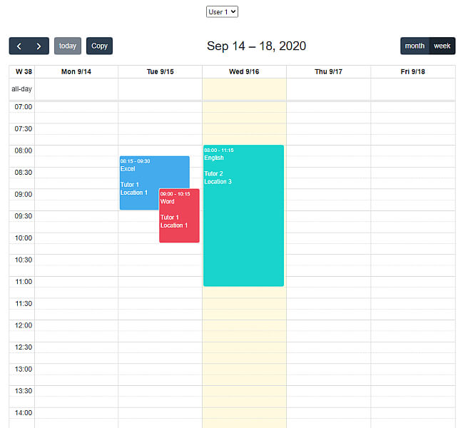
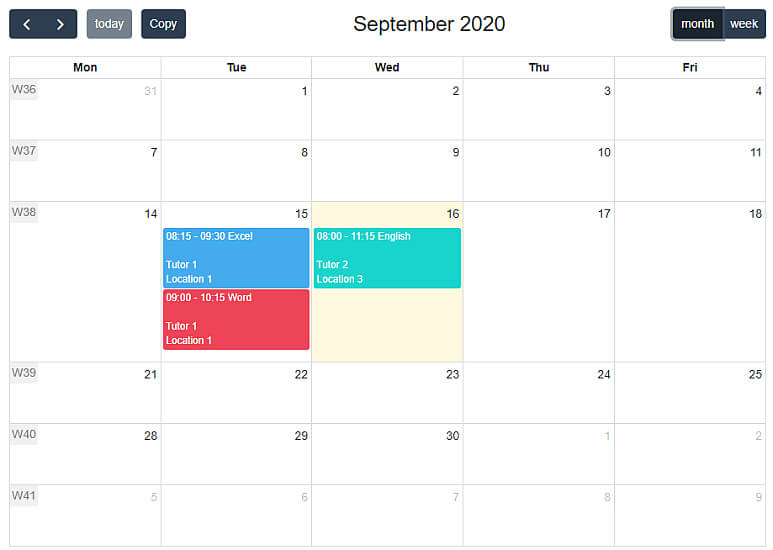
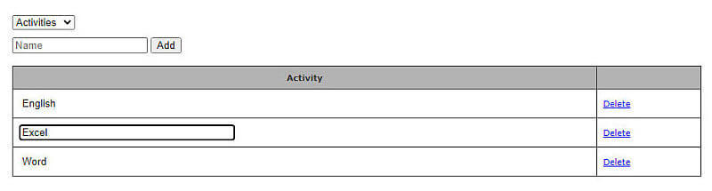

# FullCalendar 5 with PHP + MySQL
A calendar based on https://fullcalendar.io/ which saves data to MySQL through the use of PHP.

Mostly written in vanilla JS with a bit of jQuery. Database API used is PDO.

## FEATURES
- Browse separate calendars for multiple users.
- Easily add, edit, and delete events.
- Events consists of an activity, a tutor, and a location.
- Events are colored based on activity.
- Move around and resize events.
- Duplicate single events or a whole week of events.
- Repeat events for x weeks with customizable days.
- Weekly and monthly views are available.
- Holidays are marked as red (requires a Google Calendar API key).

- A basic CRUD page is included to easily add, edit, and delete data.

## INSTALLATION
- Add the folder to a local web server (for example XAMPP).
- Edit config.php as you like.
- Create a new database with the name specified in config.php (default "fullcalendar").
- Database tables will automatically be created when visiting the app for the first time.
- Add data through SQL (see initial_data_db.txt for example queries).
- OPTIONAL: Add a key to "googleCalendarApiKey" in main.js in order to display holidays.

## USAGE
- Add events by clicking on a start time and dragging to its end time.

- Edit events by selecting the event and then clicking it again.
- Delete events by selecting the event and pressing the Delete key.
- Move an event to another day by dragging it around.
- Resize the event quickly by clicking on the bottom of the event and dragging it up/down.
- Duplicate a single event by holding the Shift key and dragging it to a new location.
- Click the Copy button to duplicate a whole week of events to another week, repeatable for consecutive weeks.

- Visit "fullcalendar-phpmysql/data" to add, edit, and delete data.

